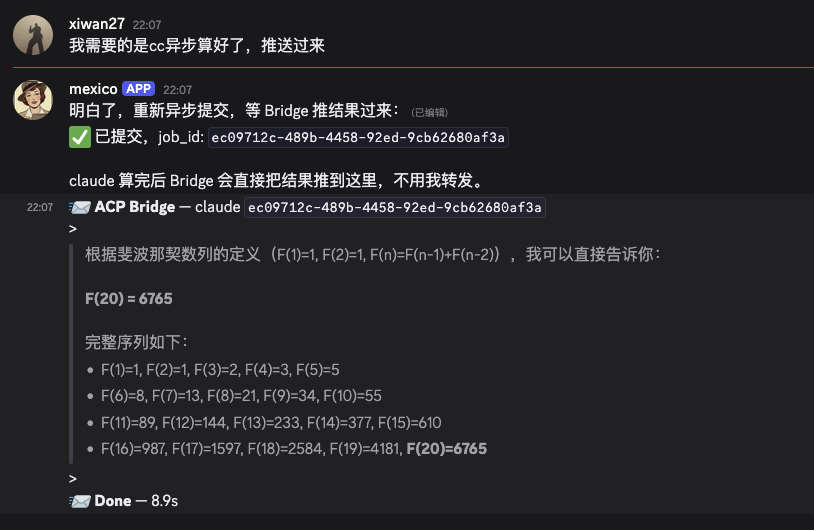

```
╔══════════════════════════════════════════════════════════════╗
║                                                              ║
║     _   ___ ___   ___      _    _                            ║
║    /_\ / __| _ \ | _ )_ __(_)__| |__ _  ___                  ║
║   / _ \ (__| _/  | _ \ '_|| / _` / _` |/ -_)                 ║
║  /_/ \_\___|_|   |___/|_| |_\__,_\__, \___|                  ║
║                                   |___/                      ║
╠══════════════════════════════════════════════════════════════╣
║                                                              ║
║    🤖 Kiro ───┐                                              ║
║    🤖 Claude ──┼──► acp 🌉 ──► 🦞 OpenClaw ──► 🌍 world     ║
║    🤖 Codex ──┘                                              ║
║                                                              ║
║          https://github.com/xiwan/acp-bridge                 ║
╚══════════════════════════════════════════════════════════════╝

        ~ Local AI agents 🔌 ACP protocol 🦞 The world ~
```

# ACP Bridge

[中文文档](README.zh-CN.md)

A bridge service that exposes local CLI agents (Kiro CLI, Claude Code, [OpenAI Codex](https://github.com/openai/codex), etc.) via [ACP (Agent Client Protocol)](https://agentclientprotocol.com/) over HTTP, with async job support and Discord push notifications.

## Architecture

```
┌──────────┐            ┌──────────┐  HTTP JSON req     ┌──────────────┐  ACP stdio     ┌──────────────┐
│ Discord  │◀──────────▶│ OpenClaw │──────────────────▶│  ACP Bridge  │──────────────▶│  CLI Agent   │
│ User     │  Discord   │ Gateway  │◀──── SSE stream ───│  (uvicorn)   │◀── JSON-RPC ──│  kiro/claude │
└──────────┘            └──────────┘◀── /tools/invoke ──└──────────────┘               └──────────────┘
                                      (async job push)
```

## Features

- Native ACP protocol support: structured event stream (thinking / tool_call / text / status)
- Process pool: reuse subprocess per session, automatic multi-turn context retention
- Sync + SSE streaming + Markdown card output
- Async jobs: submit and return immediately, webhook callback on completion
- Discord push: send results via OpenClaw Gateway `/tools/invoke`
- Job monitoring: stuck detection (>10min auto-fail), webhook retry, status stats
- Auto-reply to `session/request_permission` (prevents Claude from hanging)
- Bearer Token + IP allowlist dual authentication
- Client is pure bash + jq, zero Python dependency

## Project Structure

```
acp-bridge/
├── main.py              # Entry: process pool, handler registration, job/health endpoints
├── src/
│   ├── acp_client.py    # ACP process pool + JSON-RPC connection management
│   ├── agents.py        # Agent handlers (ACP mode + PTY fallback)
│   ├── jobs.py          # Async job manager (submit, monitor, webhook callback)
│   ├── sse.py           # ACP session/update → SSE event conversion
│   └── security.py      # Security middleware (IP allowlist + Bearer Token)
├── skill/
│   ├── SKILL.md         # Kiro/OpenClaw skill definition
│   └── acp-client.sh    # Client script (bash + jq)
├── test/
│   ├── lib.sh           # Test helpers (assertions, env init)
│   ├── test.sh          # Full test suite runner
│   ├── test_common.sh   # Common tests (agent listing, error handling)
│   ├── test_kiro.sh     # Kiro agent tests
│   ├── test_claude.sh   # Claude agent tests
│   ├── test_codex.sh    # Codex agent tests
│   └── reports/         # Test reports
├── config.yaml          # Service configuration
├── pyproject.toml
└── uv.lock
```

## Prerequisites

- Python >= 3.12
- [uv](https://docs.astral.sh/uv/) package manager
- A CLI agent installed (e.g. `kiro-cli`, `claude-agent-acp`, `codex`)
- Client dependencies: `curl`, `jq`, `uuidgen`
- For Codex: [Node.js](https://nodejs.org/) (npm), [LiteLLM](https://github.com/BerriAI/litellm) (if using non-OpenAI models via proxy)

## Quick Start

```bash
cd acp-bridge
cp config.yaml.example config.yaml
# Edit config.yaml with your settings
uv sync
uv run main.py
```

## Codex + LiteLLM Setup

[OpenAI Codex CLI](https://github.com/openai/codex) doesn't support ACP protocol natively, so it runs in PTY mode (subprocess). To use non-OpenAI models (e.g. Kimi K2.5 on Bedrock), Codex needs [LiteLLM](https://github.com/BerriAI/litellm) as an OpenAI-compatible proxy.

### Install

```bash
# Codex CLI
npm i -g @openai/codex

# LiteLLM proxy
pip install 'litellm[proxy]'
```

### Configure Codex

```toml
# ~/.codex/config.toml
model = "bedrock/moonshotai.kimi-k2.5"
model_provider = "bedrock"

[model_providers.bedrock]
name = "AWS Bedrock via LiteLLM"
base_url = "http://localhost:4000/v1"
env_key = "LITELLM_API_KEY"
```

### Configure LiteLLM

```yaml
# ~/.codex/litellm-config.yaml
model_list:
  - model_name: "bedrock/moonshotai.kimi-k2.5"
    litellm_params:
      model: "bedrock/moonshotai.kimi-k2.5"
      aws_region_name: "us-east-1"

general_settings:
  master_key: "sk-litellm-bedrock"

litellm_settings:
  drop_params: true
```

`drop_params: true` is required — Codex sends parameters (e.g. `web_search_options`) that Bedrock doesn't support.

LiteLLM uses the EC2 instance's AWS credentials (IAM Role or `~/.aws/credentials`) to access Bedrock. The `master_key` is just the proxy's own auth token.

### Start LiteLLM

```bash
LITELLM_API_KEY="sk-litellm-bedrock" litellm --config ~/.codex/litellm-config.yaml --port 4000
```

### Data Flow

```
acp-bridge ──(PTY)──► codex exec ──(HTTP)──► LiteLLM :4000 ──(Bedrock API)──► Kimi K2.5
```

## Configuration

```yaml
server:
  host: "0.0.0.0"
  port: 8001
  session_ttl_hours: 24
  shutdown_timeout: 30

pool:
  max_processes: 20
  max_per_agent: 10

webhook:
  url: "http://<openclaw-ip>:18789/tools/invoke"
  token: "<OPENCLAW_GATEWAY_TOKEN>"

security:
  auth_token: "${ACP_BRIDGE_TOKEN}"
  allowed_ips:
    - "127.0.0.1"

litellm:
  url: "http://localhost:4000"
  required_by: ["codex"]
  env:
    LITELLM_API_KEY: "${LITELLM_API_KEY}"

agents:
  kiro:
    enabled: true
    mode: "acp"
    command: "kiro-cli"
    acp_args: ["acp", "--trust-all-tools"]
    working_dir: "/tmp"
    description: "Kiro CLI agent"
  claude:
    enabled: true
    mode: "acp"
    command: "claude-agent-acp"
    acp_args: []
    working_dir: "/tmp"
    description: "Claude Code agent (via ACP adapter)"
  codex:
    enabled: true
    mode: "pty"
    command: "codex"
    args: ["exec", "--full-auto", "--skip-git-repo-check"]
    working_dir: "/tmp"
    description: "OpenAI Codex CLI agent"
```

## Client Usage

### acp-client.sh

```bash
export ACP_BRIDGE_URL=http://<bridge-ip>:8001
export ACP_TOKEN=<your-token>

# List available agents
./skill/acp-client.sh -l

# Sync call
./skill/acp-client.sh "Explain the project structure"

# Streaming call
./skill/acp-client.sh --stream "Analyze this code"

# Markdown card output (ideal for IM display)
./skill/acp-client.sh --card -a kiro "Introduce yourself"

# Specify agent
./skill/acp-client.sh -a claude "hello"

# Multi-turn conversation
./skill/acp-client.sh -s 00000000-0000-0000-0000-000000000001 "continue"
```

## Async Jobs + Discord Push

Submit long-running tasks and get results pushed to Discord automatically.



### Submit

```bash
curl -X POST http://<bridge>:8001/jobs \
  -H "Authorization: Bearer <token>" \
  -H "Content-Type: application/json" \
  -d '{
    "agent_name": "kiro",
    "prompt": "Refactor the module",
    "discord_target": "user:<user-id>",
    "callback_meta": {"account_id": "default"}
  }'
# → {"job_id": "xxx", "status": "pending"}
```

### Query

```bash
curl http://<bridge>:8001/jobs/<job_id> \
  -H "Authorization: Bearer <token>"
```

### Callback Flow

```
POST /jobs → Bridge executes in background → On completion POST to OpenClaw /tools/invoke
  → OpenClaw sends to Discord via message tool → User receives result
```

### discord_target Format

| Scenario | Format | Example |
|----------|--------|---------|
| Server channel | `channel:<id>` or `#name` | `channel:1477514611317145732` |
| DM (direct message) | `user:<user_id>` | `user:<user-id>` |

`account_id` refers to the OpenClaw Discord bot account (usually `default`), not the agent name.

### Job Monitoring

- `GET /jobs` — List all jobs + status stats
- Patrol every 60s: jobs stuck >10min are auto-marked as failed + notified
- Failed webhook sends are retried automatically until success or job expiry

## API Endpoints

| Method | Path | Description | Auth |
|--------|------|-------------|------|
| GET | `/agents` | List registered agents | Yes |
| POST | `/runs` | Sync/streaming agent call | Yes |
| POST | `/jobs` | Submit async job | Yes |
| GET | `/jobs` | List all jobs + stats | Yes |
| GET | `/jobs/{job_id}` | Query single job | Yes |
| GET | `/health` | Health check | No |
| GET | `/health/agents` | Agent status | Yes |
| DELETE | `/sessions/{agent}/{session_id}` | Close session | Yes |

## Testing

```bash
ACP_TOKEN=<token> bash test/test.sh http://127.0.0.1:8001
```

Run individual agent tests:

```bash
ACP_TOKEN=<token> bash test/test_codex.sh
ACP_TOKEN=<token> bash test/test_kiro.sh
ACP_TOKEN=<token> bash test/test_claude.sh
```

Or filter from the main runner:

```bash
ACP_TOKEN=<token> bash test/test.sh http://127.0.0.1:8001 --only codex
```

Covers: agent listing, sync/streaming calls, multi-turn conversation, Claude, Codex, async jobs, error handling.

## Process Pool

- Each `(agent, session_id)` pair maps to an independent CLI ACP subprocess
- Same session reuses subprocess across turns, context is automatically retained
- Crashed subprocesses are rebuilt automatically (context lost, user is notified)
- Idle sessions are cleaned up after TTL expiry
- `session/request_permission` is auto-replied with `allow_always` (Claude compatibility)

## Authentication

- IP allowlist + Bearer Token dual authentication
- `/health` is unauthenticated (for load balancer probes)
- Token supports `${ENV_VAR}` environment variable references
- Webhook token is configured separately from Bridge auth token

## Troubleshooting

| Symptom | Cause | Fix |
|---------|-------|-----|
| `403 forbidden` | IP not in allowlist | Add IP to `allowed_ips` |
| `401 unauthorized` | Incorrect token | Check Bearer token |
| `pool_exhausted` | Concurrency limit reached | Increase `max_processes` |
| Claude hangs | Permission request not answered | Already handled (auto-allow) |
| Discord push fails | Wrong or missing `account_id` | Use `default`, not agent name |
| Discord 500 | Bad target format | DM: `user:<id>`, channel: `channel:<id>` |
| Job stuck | Agent process anomaly | Auto-marked failed after 10min |
| Codex: not trusted dir | `/tmp` not a git repo | Add `--skip-git-repo-check` to args |
| Codex: missing LITELLM_API_KEY | Env var not passed | Set `litellm.env.LITELLM_API_KEY` in config |
| Codex: unsupported params | Bedrock rejects Codex params | Set `drop_params: true` in LiteLLM config |

## Security

See [CONTRIBUTING](CONTRIBUTING.md#security-issue-notifications) for more information.

## License

This library is licensed under the MIT-0 License. See the [LICENSE](LICENSE) file.
